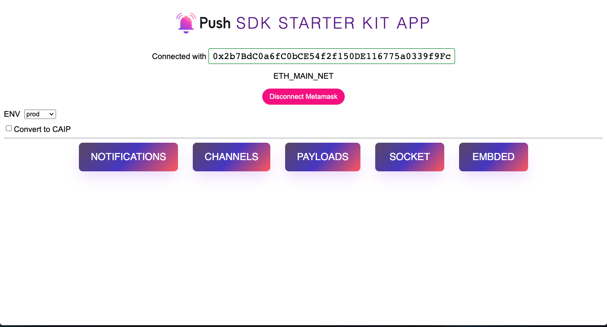

# Push Protocol + Fleek Starter Kit



## 🚀 Project Structure
  > This kit is built using Vite, React & Typescript. The SDK packages should alse work out for React using plain JS

This starter-kit is meant to showcase developers how to use the Push SDK packages.

* [@pushprotocol/restapi](https://www.npmjs.com/package/@pushprotocol/restapi) Provides access to PUSH backend APIs.
* [@pushprotocol/uiweb](https://www.npmjs.com/package/@pushprotocol/uiweb) Provides React based components to show Notifications, Spam, SubscribedModal etc for dApps.
* [@pushprotocol/uiembed](https://www.npmjs.com/package/@pushprotocol/uiembed) Provides vanilla JS sidebar notifications for any  dApp.
* [@pushprotocol/socket](https://www.npmjs.com/package/@pushprotocol/socket) Provides a socket client to connect with Push Websockets

```
/
├── dist/
├── public/
├── src/
│   ├── components/
│   │   ├── checkbox/
│   │   └── ...
│   └── pages/
│       ├── channels/
│       ├── embded/
│       ├── notifications/
│       ├── payloads/
│       └── socket/
├── index.html
├── vite.config.ts
├── tsconfig.json
└── package.json
```

You can get started by checking the `pages` folder content.

Any static assets, like images, can be placed in the `public/` directory.

## ⚙️  Dependencies
If your are trying to build out a separate dApp following this starter-kit example, some of the following dependencies are needed for the SDK and any dApp to work.

1. `@pushprotocol/uiweb` has a `peerDependency` on `styled-components`

```bash
yarn add styled-components
```

2. Since its a dApp, the following are the **web3** dependencies that you can install for wallet connection
   **Latest version of Ethers (v6) introduces some breaking changes, for best results use Ethers v5 (ethers@^5.6)**
```bash
 yarn add ethers@5.6.9
```

3. Needed only if you are using [web3-react](https://github.com/Uniswap/web3-react). You are free to use any other React based web3 solution.
```bash
yarn add @web3-react/core @web3-react/injected-connector
```

**But no need to install these if you are using the `starter-kit` itself since we have already installed these for you so that you can focus on how to use the PUSH-SDK packages**


## 🧞 Commands

All commands are run from the root of the project, from a terminal:

| Command                | Action                                           |
| :--------------------- | :----------------------------------------------- |
| `npm install`          | Installs dependencies                            |
| `npm run dev`          | Starts local dev server at `localhost:5174`      |
| `npm run build`        | Build your production site to `./dist/`          |
| `npm run preview`      | Preview your build locally, before deploying     |

## ⚡ How to deploy to Fleek

### 1. Create a `fleek.json` config file:
You can configure this site deployment using [Fleek CLI]() and running:
```
 > fleek sites init
  WARN! Fleek CLI is in beta phase, use it under your own responsibility
   ? Choose one of the existing sites or create a new one. › 
    ❯ Create a new site
```
 It will prompt you for a `name`, `dist` directory location & `build command`

 - `name`: How you want to name the site
 - `dist`: The output directory where the site is located, for this template it's `dist`
 - `build command`: Command to build your site, this will be used to deploy the latest version either by CLI or Github Actions

### 2. Deploy the site
After configuiring your `fleek.json` file, you can deployt the site by running

```
fleek sites deploy
```
After running it you will get an output like this:
```
 WARN! Fleek CLI is in beta, use it at your own discretion
  > Success! Deployed!
   > Site IPFS CID: QmP1nDyoHqSrRabwUSrxRV3DJqiKH7b9t1tpLcr1NTkm1M

    > You can visit through the gateway:
     > https://ipfs.io/ipfs/QmP1nDyoHqSrRabwUSrxRV3DJqiKH7b9t1tpLcr1NTkm1M
```

### Extra features
- **Continuous Integration (CI):** `fleek sites ci` [Documentation.](https://docs.fleek.xyz/services/sites/#continuous-integration-ci)
- **Adding custom domains:** `fleek domains create` [Documentation.](https://docs.fleek.xyz/services/domains/)


### Keep in mind:

> ⚠️  **Note:** if you try to access the site from a public gateway like `ipfs.io/ipfs/<ipfs-CID>` you may have trouble rendering the page, you can solve this issue by previewing the site using a Brave local node or by adding a [custom domain](https://docs.fleek.xyz/services/domains/)

This template has been configured to produce a static output.

```js
// vite.config.ts

import { defineConfig } from 'vite'
import react from '@vitejs/plugin-react-swc'

// https://vitejs.dev/config/
export default defineConfig({
  plugins: [react()],
  base: "./",
})
```

This means that assets will be pre-fixed with `./`, you can learn more about it in [Vite Documentation](https://vitejs.dev/config/shared-options.html#base)

## 👀 Want to learn more?

Feel free to check [Push documentation](https://docs.push.org/developers/) or jump into Push's [Discord server](https://discord.com/invite/pushprotocol).
